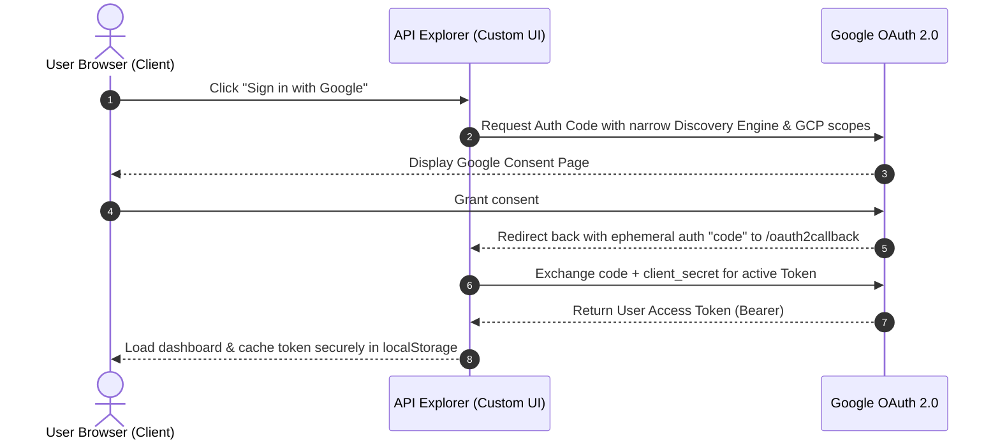
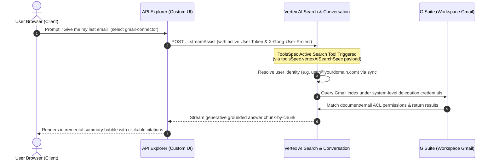

# Gemini Enterprise API Explorer


> [!IMPORTANT]
> **Disclaimer:** This repository is a local development tool and demonstration example. It is **not** an official Google product, service, or official Google-supported solution. It is provided strictly as an open-source reference template to assist developers in building and exploring integrations with the Vertex AI Discovery Engine and Gemini Enterprise APIs.

A zero-dependency local API explorer for **whitelabeling [Gemini Enterprise](https://cloud.google.com/gemini/enterprise)** via the [Discovery Engine REST API](https://docs.cloud.google.com/gemini/enterprise/docs/reference/rest). Inspired by 0nri's [gemini-enterprise-api-explorer](https://github.com/0nri/gemini-enterprise-api-explorer).

Building your own chat UI, conversation history, agent picker, search page, or NotebookLM integration on top of Gemini Enterprise? This tool lets you explore every relevant endpoint with your real project data: pick an API, tweak the request, hit send, and see the endpoint URL, response JSON, and an equivalent `curl` command you can copy into your own code.

## Features

- **40+ curated endpoints** organized by whitelabel use case — sessions (conversation history), chat (`streamAssist` / `assist`), agents (including the undocumented low-code agent builder and the review/approval workflow), search & answers, engines, data stores, documents, and NotebookLM (notebooks, sources, audio overviews, sharing).
- **Interactive Parameters Form** — Selecting `streamAssist` or `assist` replaces raw JSON editing with custom forms: textarea query boxes, selective Answer Generation Mode dropdowns, and dataStore checklists.
- **Automated DataStore Discovery** — Queries active engines under the hood via the proxy using `engines.get` to auto-populate connected dataStore checklists, featuring a manual override element to add sandbox IDs.
- **Multiturn Chat view** — Maintains ongoing conversation histories. Intercepts session names returned under `sessionInfo.session` to overwrite active Session inputs, renders alignment bubbles, streams text live with blink-dot loader indicators, and provides a clear/reset session control panel.
- **Color-Coded JSON Syntax Highlighter** — Colorizes keys (soft teal), strings (warm lime), numbers (pastel orange), booleans (soft amber), and nulls (coral red) across all panels.
- **Dynamic Engine ComboBox** — Pre-populates all engine IDs on field focus, extracting the trailing resource path slug (e.g. `gemini-enterprise-xxxxxxxx_xxxxxxxxxxxxx`) to show in an HTML5 native autocomplete combobox.
- **Automated Platform OAuth Scopes** — Automatically and silently handles the required narrow GCP & Discovery Engine platform scopes during Web Login, bypassing scary, restrictive Google Workspace permission screens and preventing app-consent blocks.
- **Streaming support** — `streamAssist` / `streamAnswer` responses render incrementally as chunks arrive.
- **Link to the official docs** for each API, matching your selected API version.
- **LLM docs** — the **LLM docs** button (top right) opens an in-browser viewer for [`public/llms.txt`](public/llms.txt), a condensed, LLM-friendly reference of all the endpoints, request shapes, and gotchas. View it, download it, or paste it into your AI coding assistant's context when building your integration. The raw file is also served at `/llms.txt`.
- **Copyable `curl`** for every request.
- **No build, no dependencies** — a single Node.js server, vanilla JS frontend.

## Prerequisites

- **Node.js 18+** (uses built-in `fetch`; no packages to install)
- **Google Cloud Platform (GCP) Project** with Vertex AI Agent Builder enabled. You will need your raw 12-digit **Project Number** (found on the main Cloud Console Dashboard, e.g., `123456789012`).

### Set Up Google OAuth 2.0 Web Client Credentials
To enable browser login, you must create web credentials in the GCP console:
1. Go to the **Google Cloud Console** -> **APIs & Services** -> **Credentials**.
2. Click **Create Credentials** -> **OAuth client ID**.
3. Select **Web application** as the *Application type*.
4. Give it a descriptive name (e.g., `GE API Explorer Custom UI`).
5. Under **Authorized redirect URIs**, click *Add URI* and enter:
   - `http://localhost:3400/oauth2callback`.
6. Click **Create**. Note down the generated **Client ID** and **Client Secret**.

* **Important:** No custom data access scopes are needed inside this web application's client configuration. Document indexing and ACL verification occur server-side under G Suite system delegation based on the federated identity matching of your logged-in Google Cloud account (e.g., `user@yourdomain.com`).

## Install & run

```sh
git clone https://github.com/amura2406/ge-customUI
cd ge-customUI
node server.js
# → http://localhost:3400
```

That's it — there are no packages to install. To use a different port: `PORT=8080 node server.js`.

## Detailed Authentication & Workspace Authorization Architecture

The Gemini Enterprise API Explorer leverages Google Cloud's official **OAuth 2.0 Web Server Flow** combined with Vertex AI Agent Builder's federated identity syncing to authenticate and authorize queries safely. This architecture involves two distinct flows:

### Diagram 1: OAuth 2.0 Web Server Flow (User-Level Authentication)
This diagram illustrates how the client acquires a secure, platform-scoped user access token using Web OAuth credentials.



### Diagram 2: Query Execution & G Suite ACL Sync (Workspace Query Authorization)
This diagram illustrates how queries are executed against Workspace data stores (e.g. Gmail) without needing direct workspace-level scopes, relying instead on system-level connections and active tool-calling payloads.



### 1. How User Authentication Works

The local server proxies all API calls to `discoveryengine.googleapis.com` under your user context:

* **Authorization Header:** Every request proxied through `/api/proxy` attaches `Authorization: Bearer <user_access_token>`.
* **Resource Project Header:** We attach `X-Goog-User-Project: <project_number>`. This header is mandatory for Google Cloud's billing and quota systems to authenticate user credentials against a specific developer resource.
* **Local Security:** Your token and client secret are stored in your browser's local storage (`localStorage`) and never leave your machine except to contact Google APIs. The proxy strictly whitelist-validates destination URLs to `discoveryengine.googleapis.com`.

### 2. OAuth Scopes: Platform Scopes vs. Workspace Scopes

One of our most critical technical findings surrounds the role of OAuth scopes when connecting to **Google Workspace data stores** (such as Gmail, Google Drive, or Google Calendar):

* **The Fallacy of Workspace Scopes:** You might expect that reading user emails or documents requires requesting individual, high-risk Google Workspace scopes like `gmail.readonly` or `drive.readonly` during OAuth sign-in. This is **incorrect** and triggers frightening security consent warnings, administrative whitelisting restrictions, or app blocking.
* **System-Level Connection:** In Vertex AI Agent Builder, Google Workspace connectors are authorized **once** by a G Suite Domain Administrator in the Cloud Console. Ingestion, indexing, and crawling are handled under the hood using system credentials or domain-wide delegation.
* **User Identity Syncing (ACLs):** When an end-user queries the app, Vertex AI Search compares the user's federated identity (from Directory Sync) against the crawled documents' Access Control Lists (ACLs) to verify read permissions.
* **Minimal Required Scopes:** Because the actual file access occurs on Vertex AI's server-side, the client application's user access token **only** needs generic Google Cloud and Discovery Engine scopes to establish *who the user is* and authorize the search query. This application requests exactly four pre-configured platform scopes:
  - `https://www.googleapis.com/auth/cloud-platform` — General Google Cloud resources.
  - `https://www.googleapis.com/auth/discoveryengine.assist.readwrite` — Required to execute stream assists, chats, and modify conversational turns.
  - `https://www.googleapis.com/auth/discoveryengine.readwrite` — Core read/write access to Discovery Engine data stores, engines, and sessions.
  - `https://www.googleapis.com/auth/discoveryengine.serving.readwrite` — Access to serving configs (search, answer, autocomplete).

### 3. The `streamAssist` Tool-Calling Gotcha

If you are using Vertex AI Search's conversational APIs (`streamAssist`), there is a critical payload configuration required to query your data stores (like Gmail):

* **Top-Level `dataStoreSpecs`:** Passing your data stores solely in the top-level `"dataStoreSpecs": [...]` array is used for **simple grounding** (matching search results as background context). 
* **The "Search Tool" Payload (`toolsSpec`):** To allow the conversational Gemini agent to actively query, read, and summarize from data stores dynamically, the data store **MUST** be declared inside the **`toolsSpec`** block as a registered tool:
  ```json
  "toolsSpec": {
    "vertexAiSearchSpec": {
      "dataStoreSpecs": [
        {
          "dataStore": "projects/{project_number}/locations/global/collections/default_collection/dataStores/{datastore_id}"
        }
      ]
    }
  }
  ```
  If `toolsSpec` is omitted, the model lacks a tool definition for searching the datastore and will output a fallback warning ("Gmail Connector Setup Required") even if your credentials and scopes are 100% correct. This explorer automatically maps selected data stores under `toolsSpec` for all `streamAssist` requests.

## Usage

### Step 1: Initial OAuth Login
When you first launch the explorer, you will be greeted by a modern **Google Sign-in** card:
* **Environment Variables Option:** If your server environment defines `GOOGLE_CLIENT_ID` and `GOOGLE_CLIENT_SECRET`, the credentials will be pre-configured.
* **Manual Configuration Option:** Otherwise, enter your GCP OAuth Web Client ID and Client Secret in the provided fields (values persist securely in your browser's local storage).
* Click **Sign in with Google** to complete the standard OAuth 2.0 redirection flow.

### Step 2: Configure Workspace Values
Once authenticated, configure your workspace endpoints at the top of the dashboard:
* **Project Number:** Enter your raw 12-digit GCP project number (e.g., `123456789012`).
* **Engine ID:** Select or enter your engine/app ID (e.g., `gemini-enterprise-xxxxxxxx_xxxxxxxxxxxxx`). If you don't know it, pick **Engine → List engines** from the left navigation panel first.
* **Region & Collection:** Typically `global` and `default_collection`.

### Step 3: Send & Inspect Requests
1. Choose an API on the left navigation panel (grouped logically by use-case).
2. Fill in form inputs or modify the editable JSON request body.
3. Click **Send request** to trigger the API.
4. Inspect the resulting endpoint URL, query params, response headers/body, and copy the equivalent, pre-authenticated `curl` command for your own integration.

### Quick tour by use case

| You want to build… | Start with |
|---|---|
| A chat UI | Assistant / Chat → `streamAssist`; leave session as `/sessions/-` to auto-create one, then reuse the returned session name |
| Conversation history sidebar | Sessions → List sessions (filter by `userPseudoId`), Get session, Update session (rename) |
| Citations / sources panel | Sessions → Get assist answer; Data Stores → Get document |
| File attachments in chat | Sessions → Add context file |
| Custom persona / branding | Assistant / Chat → Update assistant (`additionalSystemInstruction`) |
| An agent picker / builder | Agents → List, Create low-code agent, Request agent review |
| A search page | Search & Answers → Search, Answer, Autocomplete |
| A "knowledge sources" view | Engine → Get engine (`dataStoreIds`), Data Stores → List documents |
| NotebookLM features | NotebookLM → List/Create notebooks, Add sources, Generate audio overview |

## Notable findings baked into this tool

These behaviors were discovered by testing against a live project and are reflected in the request templates and descriptions:

- **Low-code agents can be created programmatically** via `agents.create` with `lowCodeAgentDefinition` (nodes of `llmAgentNode` with model/instruction/tools, linked by `subAgentIds`) — not yet in the public docs.
- **Agent review state machine**: `PRIVATE` →(`:requestAgentReview`)→ `DISABLED` →(`:rejectAgent` with `rejectionReason`, or `:withdrawAgent`)→ `PRIVATE`. Final deployment approval happens in the console.
- **Agent PATCH quirk**: `displayName` and `lowCodeAgentDefinition.draftDisplayName` must be re-sent on every patch.
- **NotebookLM lives under `locations`**, not engines, and notebook IDs are UUIDs. The web app URL is `https://notebooklm.cloud.google.com/{region}/?project={projectNumber}`.

See [`public/llms.txt`](public/llms.txt) for the full condensed reference.

## Extending the catalog

Add entries to the `APIS` array in [`public/app.js`](public/app.js):

```js
{
  id: 'group.method',
  name: 'Display name',
  desc: 'What it does and why you would use it.',
  method: 'POST',
  path: '{enginePath}/things/{thingId}:doSomething',
  docPath: 'projects.locations....things/doSomething',  // appended to the GCP docs base URL
  inputs: [{ key: 'thingId', label: 'Thing ID' }],       // path params
  query: [{ key: 'pageSize', label: 'Page size', default: '20' }],
  body: { example: 'editable default body' },            // omit for GET/DELETE
  stream: true,                                          // render response incrementally
  appLink: true,                                         // show "Open NotebookLM app" link
}
```

Path placeholders: `{locationPath}`, `{collectionPath}`, `{enginePath}`, `{assistantPath}`, plus any custom `{input}` keys.

## Project structure

```
server.js          # static file server + auth proxy (no dependencies)
public/
  index.html       # single-page UI
  app.js           # API catalog + request builder
  styles.css
  llms.txt         # LLM-friendly API reference (raw, served at /llms.txt)
  llms.html        # in-browser viewer for llms.txt
```

## Security notes

This is a **local development tool** — the server proxies API calls using the active OAuth 2.0 Web user access token stored securely in your browser's local storage. Hardening in place:

- Binds to `127.0.0.1` only (not reachable from the network).
- The proxy only accepts `application/json` requests and rejects foreign `Origin` headers, so other websites open in your browser can't drive it (CSRF).
- Proxy targets are restricted to `discoveryengine.googleapis.com` (incl. regional hosts) with an anchored host check.
- Static file serving normalizes and decodes paths and refuses anything outside `public/`.
  
## Disclaimer

> [!IMPORTANT]
> This repository is a local development tool and demonstration example. It is **not** an official Google product, service, or official Google-supported solution. It is provided strictly as an open-source reference template to assist developers in building and exploring integrations with the Vertex AI Discovery Engine and Gemini Enterprise APIs.

## License

MIT
