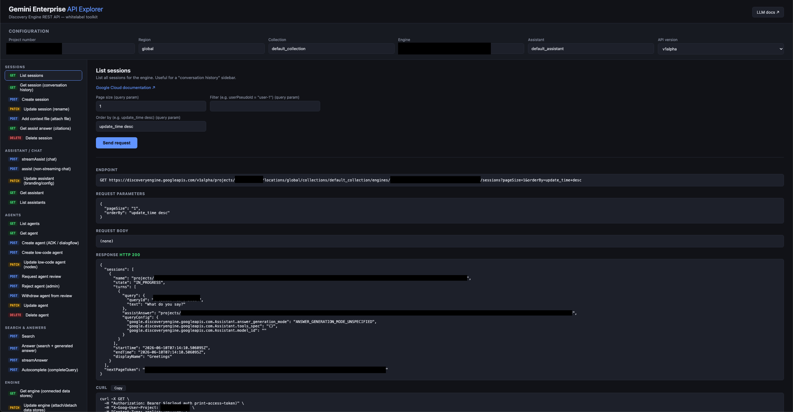

# Gemini Enterprise API Explorer



A zero-dependency local API explorer for **whitelabeling [Gemini Enterprise](https://cloud.google.com/gemini/enterprise)** via the [Discovery Engine REST API](https://docs.cloud.google.com/gemini/enterprise/docs/reference/rest). Inspired by 0nri's [gemini-enterprise-api-explorer](https://github.com/0nri/gemini-enterprise-api-explorer).

Building your own chat UI, conversation history, agent picker, search page, or NotebookLM integration on top of Gemini Enterprise? This tool lets you explore every relevant endpoint with your real project data: pick an API, tweak the request, hit send, and see the endpoint URL, response JSON, and an equivalent `curl` command you can copy into your own code.

## Features

- **40+ curated endpoints** organized by whitelabel use case — sessions (conversation history), chat (`streamAssist` / `assist`), agents (including the undocumented low-code agent builder and the review/approval workflow), search & answers, engines, data stores, documents, and NotebookLM (notebooks, sources, audio overviews, sharing).
- **Interactive Parameters Form** — Selecting `streamAssist` or `assist` replaces raw JSON editing with custom forms: textarea query boxes, selective Answer Generation Mode dropdowns, and dataStore checklists.
- **Automated DataStore Discovery** — Queries active engines under the hood via the proxy using `engines.get` to auto-populate connected dataStore checklists, featuring a manual override element to add sandbox IDs.
- **Multiturn Chat view** — Maintains ongoing conversation histories. Intercepts session names returned under `sessionInfo.session` to overwrite active Session inputs, renders alignment bubbles, streams text live with blink-dot loader indicators, and provides a clear/reset session control panel.
- **Color-Coded JSON Syntax Highlighter** — Colorizes keys (soft teal), strings (warm lime), numbers (pastel orange), booleans (soft amber), and nulls (coral red) across all panels.
- **Dynamic Engine ComboBox** — Pre-populates all engine IDs on field focus, extracting the trailing resource path slug (e.g. `gemini-enterprise-17835828_1783582887219`) to show in an HTML5 native autocomplete combobox.
- **Streaming support** — `streamAssist` / `streamAnswer` responses render incrementally as chunks arrive.
- **Link to the official docs** for each API, matching your selected API version.
- **LLM docs** — the **LLM docs** button (top right) opens an in-browser viewer for [`public/llms.txt`](public/llms.txt), a condensed, LLM-friendly reference of all the endpoints, request shapes, and gotchas. View it, download it, or paste it into your AI coding assistant's context when building your integration. The raw file is also served at `/llms.txt`.
- **Copyable `curl`** for every request.
- **No build, no dependencies** — a single Node.js server, vanilla JS frontend.

## Prerequisites

- **Node.js 18+** (uses built-in `fetch`; no `npm install` needed)
- **[gcloud CLI](https://cloud.google.com/sdk/docs/install)**, authenticated with an account that has access to your Gemini Enterprise project:

  ```sh
  gcloud auth login
  ```

- A Google Cloud project with **Gemini Enterprise** set up (an engine created via the console). You'll need the **project number** (not the project ID) — find it on the Cloud console dashboard.

## Install & run

```sh
git clone https://github.com/adithaha/ge-api-xplorer-oauth2.git
cd ge-api-xplorer-oauth2
npm start
# → http://localhost:3400
```

That's it — there are no packages to install. To use a different port: `PORT=8080 npm start`.

### How auth works

The local server proxies all API calls to `discoveryengine.googleapis.com`, attaching:

- `Authorization: Bearer <token>` from `gcloud auth print-access-token` (cached ~45 min)
- `X-Goog-User-Project: <project number>` — required when calling the API with user credentials

Your token never leaves your machine except to call Google's API. The proxy refuses URLs that don't target `discoveryengine.googleapis.com`.

## Usage

1. Fill in **Configuration** at the top: project number, region (`global`), collection (`default_collection`), engine ID, assistant (`default_assistant`), and API version (`v1alpha` has the most complete surface). Values persist in localStorage.
   - Don't know your engine ID? Run **Engine → List engines** first.
2. Pick an API in the left nav, fill in any inputs, edit the request body if present, and hit **Send request**.
3. Inspect the endpoint URL, query params, body, response, and copy the `curl` equivalent.

### Quick tour by use case

| You want to build… | Start with |
|---|---|
| A chat UI | Assistant / Chat → `streamAssist`; leave session as `/sessions/-` to auto-create one, then reuse the returned session name |
| Conversation history sidebar | Sessions → List sessions (filter by `userPseudoId`), Get session, Update session (rename) |
| Citations / sources panel | Sessions → Get assist answer; Data Stores → Get document |
| File attachments in chat | Sessions → Add context file |
| Custom persona / branding | Assistant / Chat → Update assistant (`additionalSystemInstruction`) |
| An agent picker / builder | Agents → List, Create low-code agent, Request agent review |
| A search page | Search & Answers → Search, Answer, Autocomplete |
| A "knowledge sources" view | Engine → Get engine (`dataStoreIds`), Data Stores → List documents |
| NotebookLM features | NotebookLM → List/Create notebooks, Add sources, Generate audio overview |

## Notable findings baked into this tool

These behaviors were discovered by testing against a live project and are reflected in the request templates and descriptions:

- **Low-code agents can be created programmatically** via `agents.create` with `lowCodeAgentDefinition` (nodes of `llmAgentNode` with model/instruction/tools, linked by `subAgentIds`) — not yet in the public docs.
- **Agent review state machine**: `PRIVATE` →(`:requestAgentReview`)→ `DISABLED` →(`:rejectAgent` with `rejectionReason`, or `:withdrawAgent`)→ `PRIVATE`. Final deployment approval happens in the console.
- **Agent PATCH quirk**: `displayName` and `lowCodeAgentDefinition.draftDisplayName` must be re-sent on every patch.
- **NotebookLM lives under `locations`**, not engines, and notebook IDs are UUIDs. The web app URL is `https://notebooklm.cloud.google.com/{region}/?project={projectNumber}`.

See [`public/llms.txt`](public/llms.txt) for the full condensed reference.

## Extending the catalog

Add entries to the `APIS` array in [`public/app.js`](public/app.js):

```js
{
  id: 'group.method',
  name: 'Display name',
  desc: 'What it does and why you would use it.',
  method: 'POST',
  path: '{enginePath}/things/{thingId}:doSomething',
  docPath: 'projects.locations....things/doSomething',  // appended to the GCP docs base URL
  inputs: [{ key: 'thingId', label: 'Thing ID' }],       // path params
  query: [{ key: 'pageSize', label: 'Page size', default: '20' }],
  body: { example: 'editable default body' },            // omit for GET/DELETE
  stream: true,                                          // render response incrementally
  appLink: true,                                         // show "Open NotebookLM app" link
}
```

Path placeholders: `{locationPath}`, `{collectionPath}`, `{enginePath}`, `{assistantPath}`, plus any custom `{input}` keys.

## Project structure

```
server.js          # static file server + auth proxy (no dependencies)
public/
  index.html       # single-page UI
  app.js           # API catalog + request builder
  styles.css
  llms.txt         # LLM-friendly API reference (raw, served at /llms.txt)
  llms.html        # in-browser viewer for llms.txt
```

## Security notes

This is a **local development tool** — the server makes API calls with *your* gcloud credentials. Hardening in place:

- Binds to `127.0.0.1` only (not reachable from the network).
- The proxy only accepts `application/json` requests and rejects foreign `Origin` headers, so other websites open in your browser can't drive it (CSRF).
- Proxy targets are restricted to `discoveryengine.googleapis.com` (incl. regional hosts) with an anchored host check.
- Static file serving normalizes and decodes paths and refuses anything outside `public/`.
  
## License

MIT
